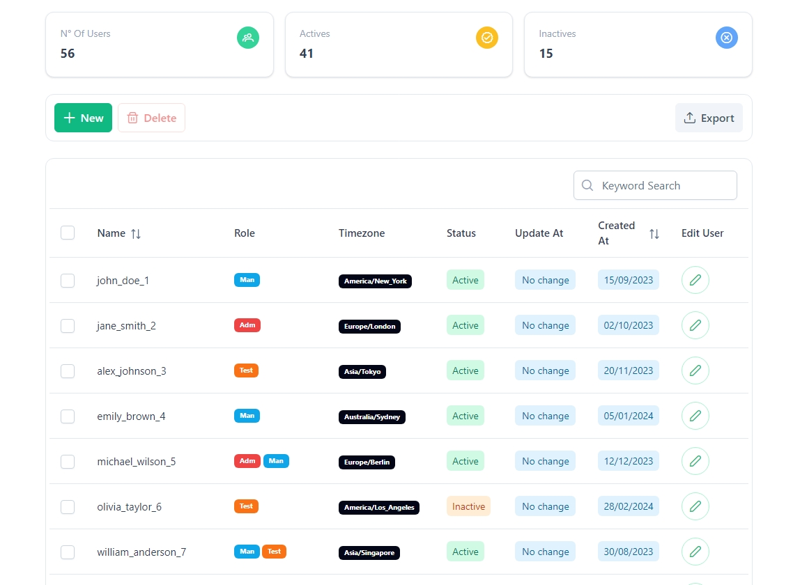
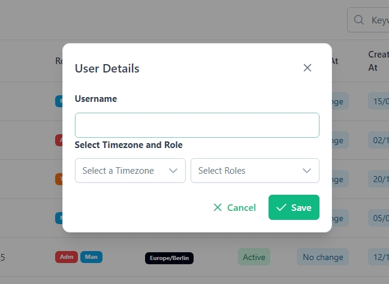
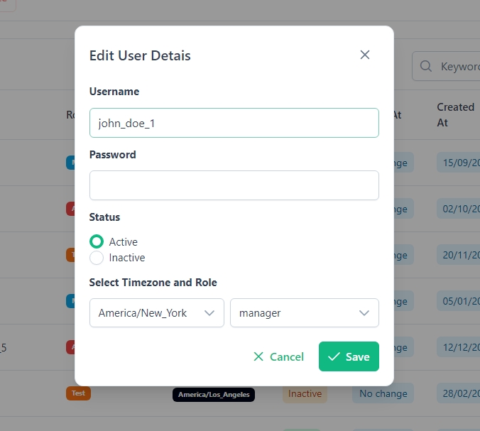
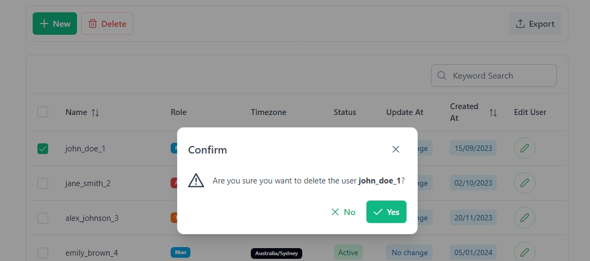
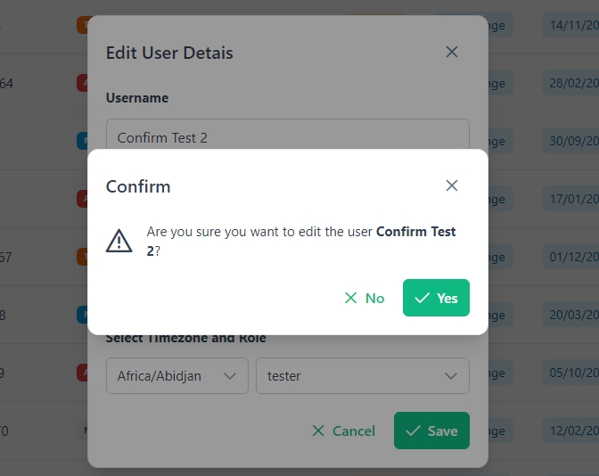

# User Manager with Vue/Flask

<!-- #788dda -->

> **Status: <span style="color:green"> Completed </span>**

###  **<span style="color:#5f6ecc"> Project to manage users data </span>**

<p  style="text-align:justify">
    The project was created to facilitate user management, performing operations such as creating, editing, and deleting users. The structure is divided into two parts, /client and /server, where the front-end was developed with Vue.jsusing the PrimeVue component library, and the back-end with the Flask framework.
</p>

## **<span style="color:#788dda"> Stacks </span>**

<div style="display: flex; gap: 3rem">
    <div>
        <h1 style="font-size:16px; color:#94abe5">Front-end</h1>
        <table>
            <thead>
                <tr>
                    <th>Package</th>
                    <th>Version</th>
                </tr>
            </thead>
            <tbody>
                <tr>
                    <td>Vue.js</td>
                    <td>3.5.13</td>
                </tr>
                <tr>
                    <td>PrimeVue</td>
                    <td>4.2.5</td>
                </tr>
                <tr>
                    <td>TailwindCSS</td>
                    <td>3.4.17</td>
                </tr>
                <tr>
                    <td>Vue Router</td>
                    <td>4.5.0</td>
                </tr>
                <tr>
                    <td>Pinia</td>
                    <td>2.3.0</td>
                </tr>
                 <tr>
                    <td>npm</td>
                    <td>10.9.0</td>
                </tr>
            </tbody>
        </table>
    </div>
    <div>
        <h1 style="font-size:16px; color:#94abe5">Back-end</h1>
        <table>
        <thead>
            <tr>
                <th>Pacote</th>
                <th>Versão</th>
            </tr>
        </thead>
        <tbody>
            <tr>
                <td>Flask</td>
                <td>3.1.0</td>
            </tr>
            <tr>
                <td>Flask-Cors</td>
                <td>5.0.0</td>
            </tr>
            <tr>
                <td>pymongo</td>
                <td>4.10.1</td>
            </tr>
            <tr>
                <td>python-dotenv</td>
                <td>1.0.1</td>
            </tr>
            <tr>
                <td>Werkzeug</td>
                <td>3.1.3</td>
            </tr>
            <tr> 
                <td>pip</td> 
                <td>24.3.1</td> 
            </tr>
        </tbody>
    </table>
    </div>
    
</div>

## **<span style="color:#788dda"> Screenshots </span>**


1) Home Page


2) Add user modal


3) Edit user modal


3) Confirm delete 


4) Confirm edit 


## **<span style="color:#788dda"> How to run  </span>**

After downloading and extracting the project, it is necessary to run some commands in the terminal. First, let's start with the client or front-end.

#### Now, how do I run this program? Follow the step-by-step guide below:

Let´s configure the front first: 

On the terminal from Vs Code, type:

```bash
  cd client
```
Now you are in the client directory, run the second command to install all the packages we need:

```bash
  npm install 
```

And then, we have the last one: 

```bash
  npm run dev 
```

The project is probably live at this point. You can access it by clicking on the link in the terminal or just copying and pasting this link into your browser: http://localhost:5173/

Now to the back-end

First, let's return to the root of the project, just type: 

```bash
  cd .. 
```
and then: 

```bash
  cd server
```

Now, within this directory, we need to install and start a virtual environment with Python, use the next command:

> Windows 
```bash
  py -3 -m venv env
```

> Mac/Linux
```bash
  python3 -m venv .env
```

Here we need to activate the enviroment: 

> Windows 
```bash
    env\scripts\activate
```

> Mac/Linux
```bash
   . .env/bin/activate
```

> **<span style="color:#788dda"> Obs: </span>** On Windows, you might encounter issues starting the virtual environment due to **<span style="color:#788dda"> PowerSheel </span>**, as it requires script execution permission. Therefore, I recommend switching to the **<span style="color:#788dda"> Command Prompt </span>** , which in my view, makes things much easier.

Now, we are finally inside the environment. You will probably know this because at the beginning of the directory path, there is an (env). Now, we can finally install our packages.

Just run this code, to install all the packages: 


```bash
   pip install -r requirements.txt
```

If everything went well, just run the server.

```bash
   flask run --port=5001 --debug
```


Now we have everything running, but there's one thing left to do: connect the project to MongoDB. It's quite easy. I'll leave a video for that here:

https://www.youtube.com/watch?v=6b3YH0kK3ig


After creating the server, we will only need three things. In the root of the project, create a file called .env. Inside it, create two environment variables: DATABASE_URL and MONGO_DB_NAME. In these two fields, you need to add the URL and the database name of your MongoDB server. I recommend setting db_name to 'user_data'.


```bash
   DATABASE_URL=<YourDBURL>
   MONGO_DB_NAME=users_data
```

Alright, you've created your database and added the variables. Now we just need to add data to the database, and that's easy.

First, navigate to the app folder. In the terminal, within the server directory, type:

```bash
   cd app
```

And then type the following command in the terminal:

```bash
   python parser.py
```

If everything goes well, the database should now be populated with the JSON data. Click the following link, and the users should be displayed: http://localhost:5173/


